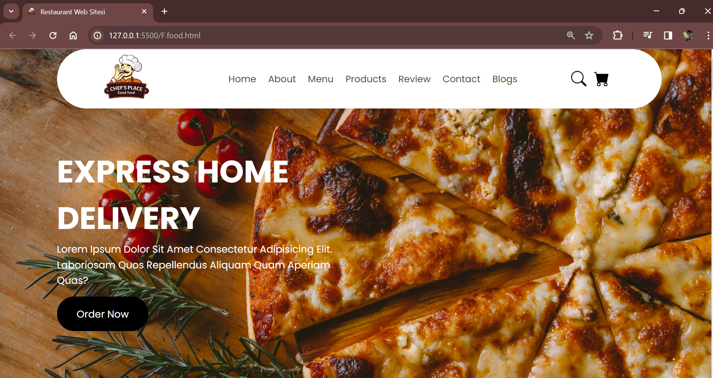

# Restaurant Website
This project is a fully responsive web application for a pizza restaurant built using HTML and CSS . The site offers a user-friendly interface where customers can explore our menu, make reservations and order online.

# Used technologies 
-HTML: is the standard markup language for creating Web pages.

-CSS: is the language we use to style a Web page.

# Preview

# GIF

